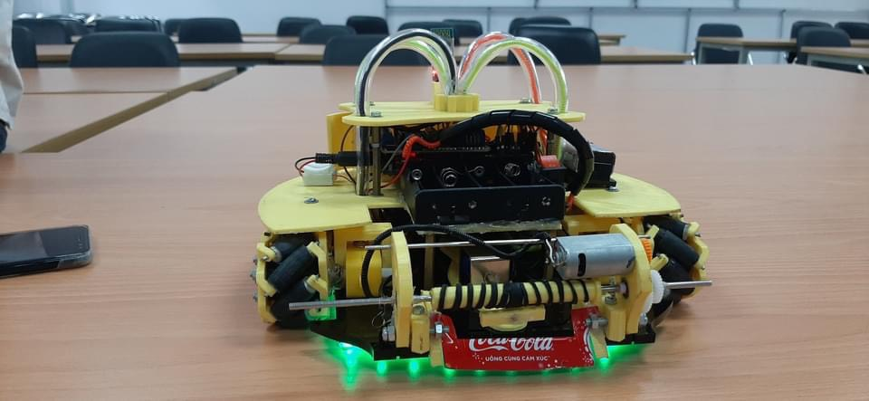
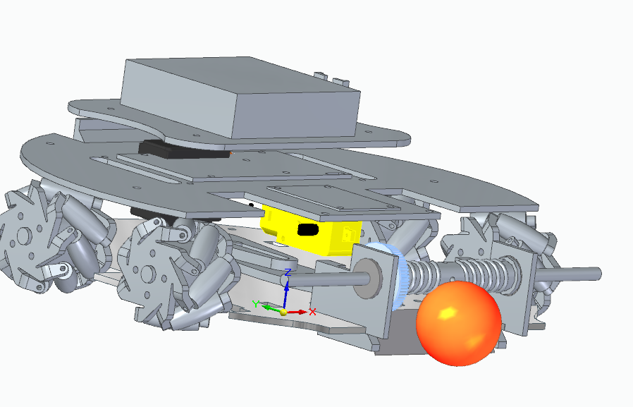
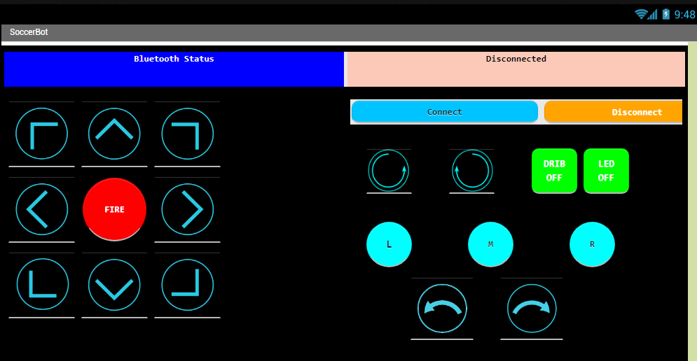
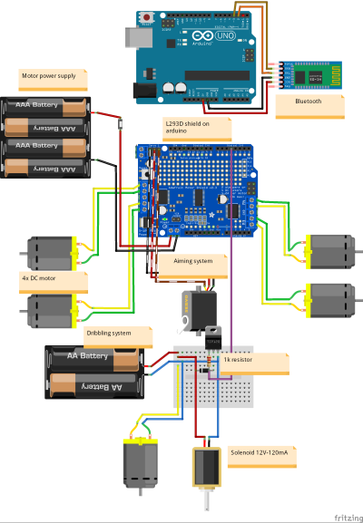

# SoccerBot


---

## Features 🚀

- **RGB Backlight**: Dynamic color-changing LED lighting for a cool visual effect.  
- **Motorized Spinner & Solenoid Kicker**: Precision ball control and kicking mechanism.  
- **3D-Printed Mecanum Wheels**: Full omnidirectional movement for agility.  
- **Bluetooth Control**: Wirelessly controlled via a custom smartphone app.  
- **Servo Mechanism**: Adjustable servo for fine-tuned actions (e.g., shooting angle).  
- **Adjustable Motor Speed**: Customize motor speeds for smooth control.  



---

## 3D Design




## Usage 📲

### 1. Upload Code (Arduino IDE)

1. **Clone the repo**:
   ```bash
   git clone https://github.com/your-username/robot-project.git
   ```
2. **Open in Arduino IDE**, install required libraries (`AFMotor`, `SoftwareSerial`).
3. **Connect Arduino**, select board & port.
4. **Upload** the sketch to the Arduino.

### 2. Control via Smartphone App

- **App built with MIT App Inventor**.
- Connect via Bluetooth and control:
  - **Movements**: 8 direction buttons.
  - **Drib**: Start, stop, speed dribbler.
  - **Fire**: Kick the ball.
  - **LED**: Turn on/off, color transitions.
  - **Servo**: Adjust angles using left and right button.


---

## Circuit Diagram 🛠️
